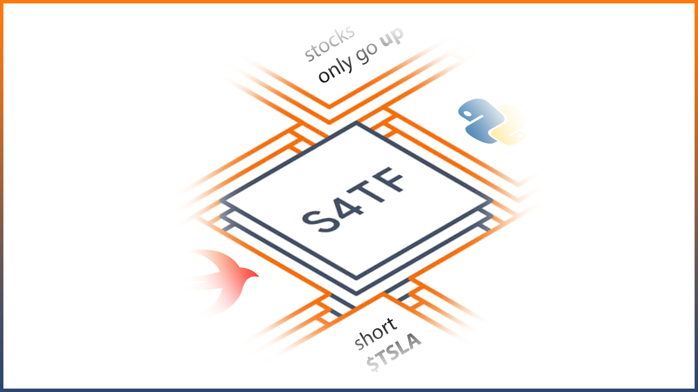

Swift for TensorFlow Python Interoperability Use Case 📈
=======
Pulling historical stock data using Aplaca's Python API from within Swift



Since I have been testing out [Vapor 4](https://github.com/vapor/vapor) extensively recently I thought it would make a lot of sense to try something out with Google's Swift for TensorFlow since many of the stock data APIs are written in Python and it would be nice to have it all within one Swift backend for algotrading. This should serve as a proof of concept that you can integrate Python with Swift. Although in this case we are merely calling a function from a Python file and printing the output from within Swift, the setup was more involved than it seems and shows that S4T's Python interoperability is still in development (although it shows great potential).

Originally I started trying to take the Alpaca API Python code and write it entirely in Swift (see the folder 'Failed Attemps'). I had to name the parameter variables for the ```alpaca_trade_api.REST()``` exactly as defined in the same function (whereas in Python we would assign them from variables that did not necessarily have the same name) because asigning them inside the parenthesis would return that the variables are not in scope 🤷‍♂️ (maybe using ```typealias``` would be a more elegant solution). That one works. Trying that same logic for the parameters in the next and last important function ```''.polygon.historic_agg_v2()``` we get a strange connection code that doesn't come up when running it in pure Python. Since that didn't let me continue I gave up trying to do it the fun way and just decided to write a simple Python script that had a function that could be called from within Swift.

You would think that it's as simple as importing the script like a normal Python module as long as it's in the same directory, right?

```swift
let scriptB = Python.import("script_b")
scriptB.do_something()
```

Not quite. After some digging I came accross a temporary solution until this gets fixed. It seems that Python doesn't include the Swift script's current working directory in the path. One way to add it is by:

```swift
let os = Python.import("os")
let sys = Python.import("sys")
sys.path.append(os.getcwd())
```
As for the instructions for the Alpaca API, their [github page](https://github.com/alpacahq/alpaca-trade-api-python) is a good strating point albiet a bit messy.

## Setup 👨‍💻

You need to [install](https://github.com/tensorflow/swift/blob/master/Installation.md) a special Swift toolchain made for Swift for TensorFlow that allows you to import the PythonKit and TensorFlow modules and use all of their magic. Additionally you need to add to your path a PYTHON_LIBRARY variable that points to a specific libpython file. The way to specify the environment inside the code like ``` 
PythonLibrary.useVersion(3, 7)``` mentioned on the TF website did not work for me. For my case it was like so for the path variable:

```bash
export PYTHON_LIBRARY="/Users/user/opt/anaconda3/lib/libpython3.7m.dylib"
```

Also make sure to add to your path the location of the toolchains so you can use them outside of XCode in a Mac or Linux machine through the terminal. On my Mac this was:

```bash
export PATH=/Library/Developer/Toolchains/swift-latest/usr/bin:"${PATH}"


```

You also need a funded U.S. Alpaca brokerage account in order to use Polygon's historical data through the Alpaca API. Even a few dollars (I started mine with $2) can get you started with using this data as long as you are in the states (hopefully they expand this to other countries). For fun I tried to build the S4T toolchain in Ubuntu 20.04.1 and it did not work (it should work on 18.04.1).

## Other Notes 📘

This is a very simple version of a more complex historical data retreival I have in my Vapor-powered algotrading backend. I hope someone finds this useful as it took a few hours of digging to gather all of this information together since the Swift 4 Tensorflow documentation is not abundant at the moment of writing. Happy trading (or backtesting)!